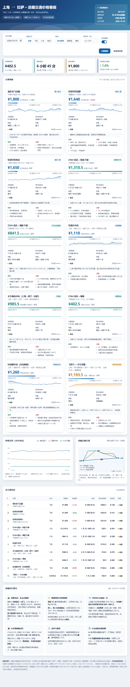

# 上海 ⇄ 拉萨 · 进藏 / 出藏交通价格看板

一个**单文件、零依赖、离线可用**的高原交通价格分析页面。**去程（上海 → 拉萨）与
返程（拉萨 → 上海）各 10 条主流方案**——飞机 / 火车 / 空铁联运——的价格、时长、
性价比放在一起对比，并给出未来 90 天的价格走势。

**在线预览** → <https://oasisdragon.github.io/tibet-transport-price/>

也可以直接下载后用浏览器打开 `index.html`，不需要服务器、不需要联网、不需要构建。



---

## 功能

### 去程 / 返程双向查询
控制栏最左边是「行程方向」开关，一键在 **上海 → 拉萨** 与 **拉萨 → 上海** 之间切换。

两个方向是**各自独立建模**的，而不是把去程数据倒过来用：

- **班次时刻不同。** 拉萨贡嘎机场午后风力增大、准点率明显下降，出港航班集中在上午。
  把去程时刻简单反转会得到一堆下午起飞的班次，与真实情况不符，所以返程单独排了时刻表。
- **票价不同。** 离藏需求集中，返程机票普遍比去程高一档，价格区间也不一样。
- **火车车次不同。** 去程 Z164/Z165（上海站 18:33 发车），返程 Z166/Z163（拉萨站 12:45 发车），
  全程同为 4372 公里 / 45 小时 03 分，票价一致。

切换时，标题、海拔方向、走廊示意图、出行提示、页脚车次会整体跟着变，
价格历史与极值同时重置——不会出现「拉萨的方案挂着上海的历史价格」这种串味。

### 价格 × 出行日期折线图
横轴是未来 90 天的出发日期，纵轴是含税价，**10 条方案各一色**。
图例可点开关，鼠标悬停（手机上手指按住）会显示当天所有方案的具体班次与价格，
虚线标出你当前选中的出行日。

### 班次时段筛选：「避开阴间时段」
最便宜的那班往往就是凌晨落地的红眼。页面给每个方案建了当天的班次时刻表，
默认只考虑**正常时段**的班次，再在其中取最低价：

> 正常时段 = `06:00 ≤ 起飞`，且 `06:00 ≤ 抵达 < 22:00`
>
> 也就是排除红眼起飞、红眼抵达、以及 22:00 之后才落地的班次。
> 去程是深夜落地拉萨——海拔 3650 米，当晚很难适应；
> 返程则是深夜从拉萨起飞、凌晨才到上海，第二天还要上班，同样吃不消。

控制栏的开关可以随时关掉，用来对比「省这点钱要凌晨落地，值不值」。

当天**没有合适班次**的方案不会被藏起来，也不会拿红眼价冒充最低价——
它在卡片和表格里保留，打上「时段不合适」标记并写明原因，
同时排除在「当前最低价 / 综合推荐」之外、不在折线图上画线。

### 其他
- **4 个 KPI**：当前最低价、最快抵达、综合推荐、本轮最大波动
- **方案明细卡片**：价格、区间位置、本次最低、未来 90 天迷你走势、耗时、每小时成本、班期、余票、舒适度、优缺点
- **走廊示意图**：腾讯地图 GL JS，检测不到本地代理时自动降级为自绘 SVG 走廊图，起终点随方向翻转
- **全方案对比表**：9 个字段，窄屏自动重排成堆叠卡片
- **出行提示**：高反、购票时机、中转、火车票、证件、季节 6 张，内容随方向切换
- **数据源设置**：可接入自己的价格接口，实现真正的实时取价，方案 id 列表随方向自动更新
- 目标价提醒、自动刷新（间隔可调）、排序 / 筛选

---

## 快速开始

```bash
# 直接用浏览器打开就行
start index.html          # Windows
open  index.html          # macOS

# 跑测试（需要 Node 20+）
npm install
npm test
```

`npm test` 会跑两套：

| 套件 | 断言数 | 内容 |
|---|---|---|
| `tests/engine.test.js` | 1235 | 价格引擎纯函数：因子单调性、区间约束、3000 步无漂移、班次时段边界、刻度生成、排序筛选、双向数据完整性 |
| `tests/ui.test.js` | 187 | jsdom 端到端：渲染完整性、交互、图例开关、时段筛选、去程 / 返程切换、无未捕获异常 |

---

## 目录结构

```
index.html              页面本体（HTML + CSS + JS 全在一个文件里）
.nojekyll               让 GitHub Pages 跳过 Jekyll 处理
LICENSE                 MIT
package.json            测试脚本与开发依赖
package-lock.json       锁定依赖版本
assets/
  route-price-long.png  长图版（微信 / 朋友圈分享用）
tests/
  engine.test.js        价格引擎单元测试
  ui.test.js            jsdom 端到端测试
tools/
  mkshot.js             生成长图专用的页面副本（冻结定时器、去掉地图 CDN）
  shot.js               量高 + 精确截图，输出到 assets/
```

---

## 部署

页面是纯静态单文件，任何静态托管都能直接跑。仓库已开启 GitHub Pages，
从 `main` 分支根目录发布：

<https://oasisdragon.github.io/tibet-transport-price/>

推送到 `main` 后会自动重新构建，通常 30 秒左右生效。

---

## 实现要点

### 纯函数核心与 DOM 层分离

`index.html` 里有两段 `<script>`，用注释标记切开：

- `PARSER_START` / `PARSER_END` —— 价格引擎、日期工具、班次筛选、刻度生成，
  全部是**不碰 DOM 的纯函数**，末尾 `module.exports` 出去
- `UI_START` / `UI_END` —— 渲染与事件绑定

测试脚本按标记把前一段抽出来 `require`，于是**同一份代码既能跑在浏览器里，
也能跑在 Node 里做单元测试**，不存在「测试和线上是两份实现」的问题。

### 随机源注入

所有涉及随机的函数都把 `rnd` 作为参数传入，而不是直接调 `Math.random`：

```js
function stepPriceFrom(p, route, target, rnd){
  var vol = span * (route.mode === 'flight' ? 0.012 : 0.004);
  return clamp(p + (p - target) * ... + (rnd() * 2 - 1) * vol, route.range[0], route.range[1]);
}
```

测试传一个 LCG 伪随机进去，价格序列就完全可复现，不用 mock 全局。

### 价格模型

```
目标价 = basePrice × 季节因子 × 星期因子 × 提前天数因子 × 库存因子
```

火车票（Z164 系列）的价格波动被压到机票的 18%，因为铁路实行的是公布票价 + 有限浮动，
不像机票那样一天三变。

### 时段筛选贯穿所有价格出口

选中班次的折扣系数被折进目标价，所以 `route.price` 始终是「这个方案的当前价」，
卡片、对比表、折线图都不用改读法：

```js
var k = pick.best.slot.k;
r.target = roundPrice(clamp(targetPriceOf(r, travelDate, now) * k, r.range[0], r.range[1]), r);
```

---

## 数据来源与免责声明

- **机票价格**：默认由内置行情引擎按「季节 × 星期 × 提前预订天数 × 库存波动」模型推算，
  用于展示价格结构与变化趋势，**不构成购票依据**。
- **火车票价**：铁路部门公布全价。进藏 Z164/Z165（上海—拉萨）与出藏 Z166/Z163（拉萨—上海）
  同价：硬座 402.5 / 硬卧上中下 793.5 · 817.5 · 841.5 / 软卧 1262.5 · 1310.5 元。
  铁路实行浮动票价制，实际以 12306 当日执行价为准。
- **航班时刻与班期**：参考东航、西藏航空 2026 年公开信息。
  进藏的浦东直飞、虹桥经停西安 / 成都与 Z164 采用公开班期；出藏的贡嘎直飞浦东、
  贡嘎经停西安 / 成都与 Z166 同样采用公开班期，并按「拉萨出港集中在上午」的
  真实规律单独排布时刻，而非把去程反转。
- **班次时刻与折扣系数**：经成都 / 经重庆中转、飞西宁 + 火车属于「每天多班」，
  页面按「上海段 × 进藏段」或「拉萨段 × 回沪段」的代表性组合建模，
  红眼班次的低价系数为经验估值，**仅用于演示时段筛选逻辑，实际班次与价格以购票平台为准**。
- 燃油附加费自 2026 年 8 月 5 日起，800 公里以上航段降至 70 元/人/航段。

页面默认不联网、不抓取任何第三方数据。想接真实数据，
点右上「数据源设置」填入自己的接口地址即可，接口返回格式见页面内提示
（方案 id 会随方向切换，返程方案统一带 `-back` 后缀）。

---

## 许可证

[MIT](LICENSE) © 2026 oasisDRAGON
